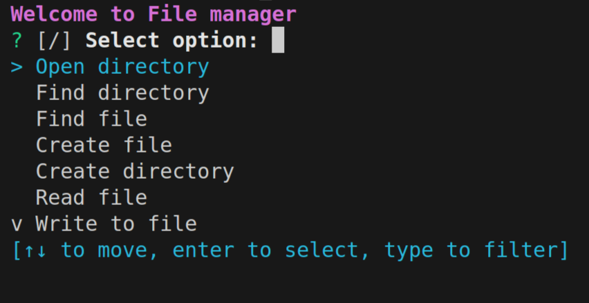

<h1 align="center"> Simple File manager </h1>

---

This program was written in Rust language. Create new project and add main.rs with Cargo.toml

After that just run it: in the terminal You will see user-friendly interface. Now You can open, find, create and remove files and directories.

Firstly I would like to recommend opening the directory where You will be working, because it is convenient. Then manage your files: Rust will provide good performance and safety.
